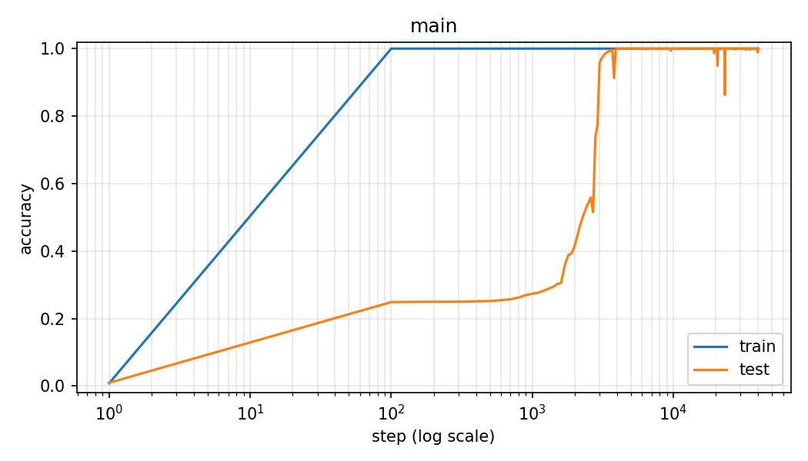

# Grokking on Modular Arithmetic

A small transformer trained on `(a + b) mod p` memorizes the training set almost
immediately, then, well after training accuracy has saturated, suddenly generalizes to the
test set. This is a replication of that phenomenon, first described in Power et al. (2022).



## What is grokking?

Grokking is a training regime where a model achieves perfect (or near-perfect) train
accuracy long before it achieves any test accuracy at all, then, thousands of steps later,
generalizes suddenly and completely. The plot above is the archetype: train accuracy pins
to 1.0 by step 100, test accuracy sits flat for over an order of magnitude of additional
steps, then rises to 1.0 in a sharp cliff around steps 2,300 to 3,500. The phenomenon is
fragile, and this repo shows both the knob that makes it appear (weight decay) and the
knob that makes it collapse (data fraction).

## Setup

- Task: `(a + b) mod p`, `p = 113`. All 12,769 pairs enumerated and randomly split.
- Sequence: `[a, b, =]`. Predict the last position. Vocab size `p + 1 = 114`.
- Model: 1-layer transformer decoder, `d_model = 128`, 4 heads, `d_mlp = 512`,
  pre-LayerNorm, ~228K parameters.
- Optimizer: AdamW, `lr = 1e-3`, `weight_decay = 1.0`, `betas = (0.9, 0.98)`.
- Training: full-batch, 40,000 steps, cross-entropy on the equals position.
- Logging: train and test eval every 100 steps. Model checkpoint every 2,000 steps.
- Hardware: Apple M3 (8-core, 8GB), PyTorch MPS backend. A full 40k-step run takes 25 to
  60 minutes depending on the training fraction (see the variants table below for
  per-run wall clocks).

## Main result

The main run uses `frac_train = 0.25` (3,192 training pairs, 9,577 test pairs).

| Milestone | Step |
|---|---|
| train_acc first >= 0.999 (memorization) | 100 |
| test_acc first >= 0.50 | 2,300 |
| test_acc first >= 0.99 (generalization) | 3,500 |
| final test_acc | 1.0000 |
| final test_loss | 0.0031 |
| wall clock, full 40k steps | 26m 56s |

For roughly two thousand steps between memorization and the cliff, train accuracy is
pinned at 1.0 while test accuracy sits flat around 0.25. Test loss actually rises during
this window: the model becomes more confidently wrong on the held-out pairs before it
suddenly becomes right. On a linear step axis the cliff is invisible for the first
several thousand steps, which is why the plot uses a log-x scale.

## Variants

| Run | frac_train | weight_decay | Grokked? | Steps to memorize | Steps to generalize (test >= 99%) | Wall clock (40k steps) |
|-----|------------|--------------|----------|-------------------|-----------------------------------|------------------------|
| main              | 0.25 | 1.0 | yes, sharp cliff | 100 | 3,500 | 26m 56s |
| ablation-wd0      | 0.25 | 0.0 | no               | 100 | did not generalize within 40k steps | 25m 21s |
| ablation-highdata | 0.50 | 1.0 | no visible cliff | 100 | 200 | 57m 51s |

All runs completed with exit code 0 on the same Apple M3 machine. The
`ablation-highdata` run is roughly 2x slower per step because doubling `frac_train` doubles
the full-batch size, and each step's forward and backward passes are dominated by the
batch dimension. The `sanity` run (`frac_train = 0.30`, not in this table) took 45m 53s.

The two ablations bracket the grokking regime.

**`ablation-wd0`** memorizes the training set on the same step 100 as the main run, but
never generalizes in 40,000 steps. Final test accuracy is 0.254 and final test loss is
19.23, i.e. the model becomes very confidently wrong on held-out pairs and stays that way.
This is the direct evidence that weight decay is what pushes the memorized solution
toward the generalizing one. Without it, the memorized solution is a stable fixed point.

**`ablation-highdata`** doubles the training set (frac 0.5) and skips grokking entirely.
Train and test rise together in lockstep and both hit 1.0 by step 200, no plateau, no
cliff. With enough data, memorization is no longer a lower-loss shortcut, so there is
nothing to escape from and nothing to see.

The `sanity` run (`frac_train = 0.30`, `weight_decay = 1.0`) is included for reference.
It grokks earlier and more gently than the main run (test >= 99% at step 1,600), which is
why the main run is the hero plot.

## What I'd explore next

- **Other modular operations.** Repeat on `(a * b) mod p`, `(a - b) mod p`,
  `(a^2 + b^2) mod p`. Grokking is known to appear for many of these; interesting is
  whether the number of steps to generalize scales predictably with something like the
  circuit complexity of the target function.
- **Fourier structure in the trained weights.** One of the more striking follow-ups
  (Nanda et al., 2023) shows that the grokked model implements modular addition via a
  discrete Fourier transform: the embedding matrix aligns with a small set of frequencies
  over `Z / pZ`. The 21 checkpoints saved during the main run (`results/main/checkpoints/`)
  are meant to make this analysis tractable. The concrete next step is to plot the
  singular value spectrum and rotated principal components of `tok_emb.weight[:p, :]`
  across steps and watch the sinusoidal structure emerge over the cliff.
- **The wd=0 fixed point.** In `ablation-wd0`, test loss keeps drifting upward for the
  full 40k. Does it eventually settle at some finite value, or diverge? A longer run and
  a sweep of small nonzero weight decay values would sharpen the picture of where the
  memorization basin turns into the generalization basin.

## Running it

```bash
# Sanity check, mild cliff around step 1,600.
python train.py --config configs/sanity.yaml

# Main run, hero plot.
python train.py --config configs/main.yaml

# Ablations.
python train.py --config configs/ablation-wd0.yaml
python train.py --config configs/ablation-highdata.yaml

# Plots.
python plot.py --run results/main
python plot.py --run results/ablation-wd0
python plot.py --run results/ablation-highdata
```

Requires PyTorch (MPS or CUDA optional), numpy, pandas, matplotlib, pyyaml.

## References

- Power, Burda, Edwards, Babuschkin, Misra. *Grokking: Generalization Beyond Overfitting
  on Small Algorithmic Datasets*, 2022.
- Nanda, Chan, Lieberum, Smith, Steinhardt. *Progress Measures for Grokking via
  Mechanistic Interpretability*, 2023.
